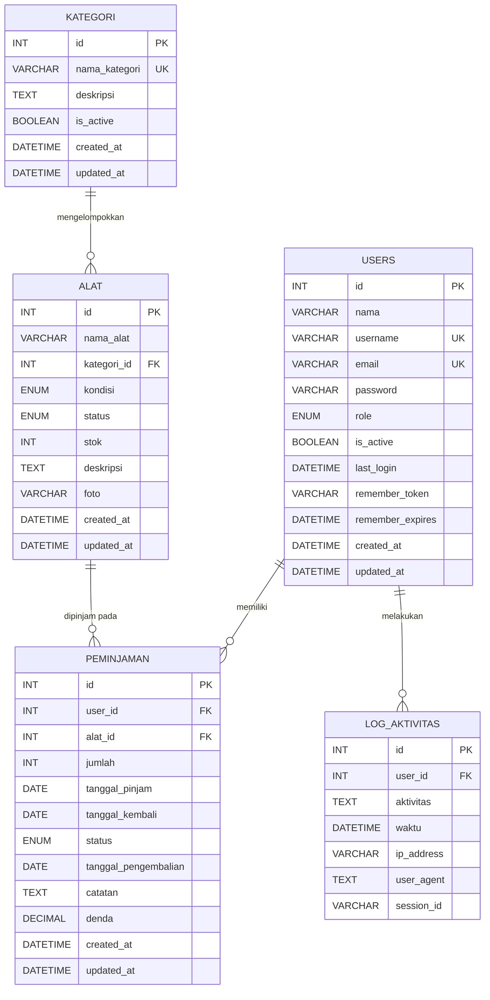
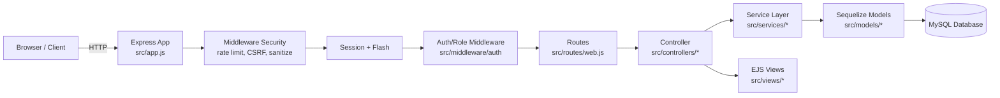
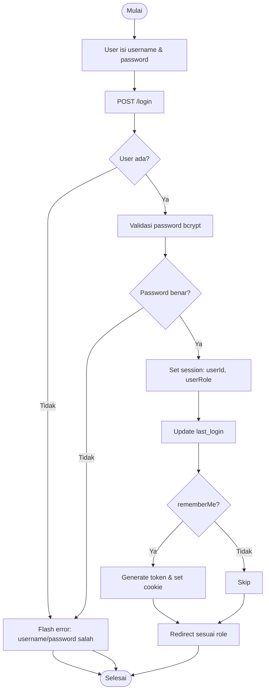
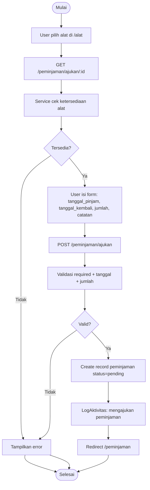
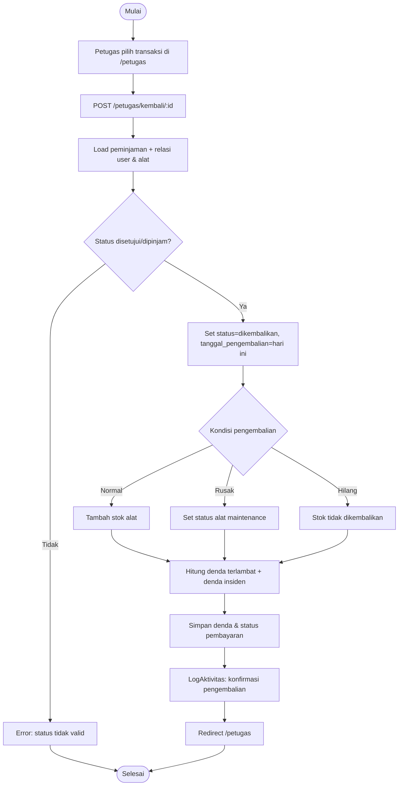

# Dokumentasi UKK - eSarpra (Sistem Peminjaman Alat)

Dokumen ini menyajikan metode pengembangan **Waterfall (sederhana/prototype)**, struktur data + akses data (termasuk tipe data), diagram (ERD & diagram program), flowchart/pseudocode untuk proses inti, serta dokumentasi modul (Input-Proses-Output) berdasarkan implementasi pada repo ini.

---

## 1) Metode Pengembangan: Waterfall (Sederhana/Prototype)

### a. Analisis Kebutuhan

#### Tujuan sistem

- Mengelola inventaris alat (kategori, kondisi, stok, status).
- Mengelola akun pengguna dengan role: `admin`, `petugas`, `peminjam`.
- Mengelola transaksi peminjaman: pengajuan, persetujuan/penolakan, pengembalian.
- Menyediakan riwayat, log aktivitas, dan laporan ringkas.

#### Aktor & hak akses

- **Peminjam**
  - Registrasi dan login.
  - Melihat daftar alat yang tersedia.
  - Mengajukan peminjaman.
  - Membatalkan pengajuan selama masih `pending`.
  - Melihat riwayat peminjaman.
- **Petugas**
  - Login.
  - Melihat daftar peminjaman aktif (pending/disetujui/dipinjam).
  - Menyetujui / menolak pengajuan.
  - Mengonfirmasi pengembalian.
  - Melihat laporan (route `/laporan`).
- **Admin**
  - Login.
  - Dashboard statistik.
  - CRUD kategori & alat.
  - Manajemen user (buat/hapus non-admin).
  - Melihat log aktivitas.
  - Melihat laporan (route `/admin/laporan`).

#### Kebutuhan fungsional (ringkas)

- Autentikasi berbasis session + (opsional) “remember me”.
- Otorisasi berbasis role.
- Validasi input (tanggal peminjaman, jumlah, form required).
- Validasi form sisi-klien untuk auth dan peminjaman (JavaScript di `public/js/`).
- Pencatatan log aktivitas.
- Cache untuk beberapa halaman indeks (alat/kategori/peminjaman/dashboard).
- Manajemen denda pengembalian: denda keterlambatan + denda insiden (rusak/hilang).
- Pembayaran denda: upload bukti, verifikasi petugas, atau pencatatan tunai.
- Export laporan ke PDF dan Excel dari halaman laporan.

#### Kebutuhan non-fungsional (ringkas)

- Keamanan: rate limit login, CSRF, security headers, sanitasi input.
- Upload foto alat dengan validasi tipe/ukuran dan CSRF untuk multipart.
- Konsistensi data: relasi foreign key dan validasi model.
- Maintainability: arsitektur berlapis routes → controller → service → model.

### b. Desain (ERD & Diagram Program)

Deliverable:

- **ERD** (lihat bagian 3).
- **Diagram arsitektur program & alur kontrol** (lihat bagian 3).
- Rancangan proses inti: login, peminjaman, pengembalian + denda (lihat bagian 4).

### c. Implementasi Kode

#### Teknologi

- Node.js + Express (`src/app.js`)
- View: EJS (`src/views/`)
- ORM: Sequelize (`src/models/`)
- DB: MySQL (konfigurasi di `src/config/database`)

#### Lapisan aplikasi (ringkas)

- Route: `src/routes/web.js`
- Controller: `src/controllers/*.js`
- Service (business logic): `src/services/*.js`
- Model (schema + validasi + relasi): `src/models/*.js`, `src/models/associations.js`
- Middleware: `src/middleware/*.js`
- Frontend behavior: `public/js/*.js` (auth, home, layout, alat, peminjaman)

### d. Pengujian

Pengujian dilakukan menggunakan Jest (lihat script `npm run test`) dengan fokus:

- Unit test util/middleware & service.
- Test controller/route menggunakan supertest (lihat folder `tests/`).

Contoh skenario uji inti (minimal):

- Login: username tidak ditemukan, password salah, sukses login dan redirect sesuai role.
- Pengajuan peminjaman: tanggal tidak valid, stok tidak cukup, sukses membuat `pending`.
- Persetujuan petugas: hanya `pending` yang bisa disetujui; stok berkurang.
- Pengembalian: status valid untuk return; stok bertambah; status menjadi `dikembalikan`.

### e. Dokumentasi

Deliverable:

- Struktur data + tipe data (bagian 2).
- Diagram (bagian 3).
- Flowchart/pseudocode (bagian 4).
- Dokumentasi modul IPO (bagian 5).

---

## 2) Struktur Data, Akses Data, dan Control Program

### 2.1 Struktur Data (Model/Tabel) + Tipe Data

Catatan:

- Definisi field mengikuti Sequelize model di `src/models/`.
- Penamaan tabel menggunakan `underscored` dan `timestamps: false` (kolom waktu didefinisikan manual).

#### Tabel: `users` (Model: `User`)

Sumber: `src/models/User.js`

| Field | Tipe | Aturan/Pembatasan | Keterangan |
| --- | --- | --- | --- |
| `id` | INT | PK, AI, NOT NULL | ID user |
| `nama` | VARCHAR(100) | NOT NULL | Nama lengkap |
| `username` | VARCHAR(50) | UNIQUE, NOT NULL | Username login |
| `email` | VARCHAR(100) | UNIQUE, NOT NULL | Email |
| `password` | VARCHAR(255) | NOT NULL | Password hash (bcrypt) |
| `role` | ENUM | `admin/petugas/peminjam` | Role akses |
| `is_active` | BOOLEAN | default `true` | Status akun |
| `last_login` | DATETIME | nullable | Terakhir login |
| `remember_token` | VARCHAR(255) | nullable | Token (hash) remember-me |
| `remember_expires` | DATETIME | nullable | Expire token |
| `created_at` | DATETIME | default NOW | Waktu dibuat |
| `updated_at` | DATETIME | default NOW | Waktu diubah |

#### Tabel: `kategori` (Model: `Kategori`)

Sumber: `src/models/Kategori.js`

| Field | Tipe | Aturan/Pembatasan | Keterangan |
| --- | --- | --- | --- |
| `id` | INT | PK, AI, NOT NULL | ID kategori |
| `nama_kategori` | VARCHAR(100) | UNIQUE, NOT NULL | Nama kategori |
| `deskripsi` | TEXT | nullable | Deskripsi |
| `is_active` | BOOLEAN | default `true` | Status kategori |
| `created_at` | DATETIME | default NOW | Waktu dibuat |
| `updated_at` | DATETIME | default NOW | Waktu diubah |

#### Tabel: `alat` (Model: `Alat`)

Sumber: `src/models/Alat.js`

| Field | Tipe | Aturan/Pembatasan | Keterangan |
| --- | --- | --- | --- |
| `id` | INT | PK, AI, NOT NULL | ID alat |
| `nama_alat` | VARCHAR(100) | NOT NULL | Nama alat |
| `kategori_id` | INT | FK → `kategori.id` | Kategori alat |
| `kondisi` | ENUM | `baik/rusak_ringan/rusak_berat` | Kondisi fisik |
| `status` | ENUM | `tersedia/dipinjam/maintenance` | Status ketersediaan |
| `stok` | INT | default 1, min 0 | Jumlah stok |
| `deskripsi` | TEXT | nullable | Deskripsi alat |
| `foto` | VARCHAR(255) | nullable | URL foto atau path upload `/uploads/alat/...` |
| `created_at` | DATETIME | default NOW | Waktu dibuat |
| `updated_at` | DATETIME | default NOW | Waktu diubah |

#### Tabel: `peminjaman` (Model: `Peminjaman`)

Sumber: `src/models/Peminjaman.js`

| Field | Tipe | Aturan/Pembatasan | Keterangan |
| --- | --- | --- | --- |
| `id` | INT | PK, AI, NOT NULL | ID transaksi |
| `user_id` | INT | FK → `users.id` | Peminjam |
| `alat_id` | INT | FK → `alat.id` | Alat dipinjam |
| `jumlah` | INT | default 1, min 1 | Jumlah dipinjam |
| `tanggal_pinjam` | DATE | NOT NULL | Tanggal mulai |
| `tanggal_kembali` | DATE | NOT NULL | Tanggal rencana kembali |
| `status` | ENUM | `pending/disetujui/dipinjam/dikembalikan/ditolak/dibatalkan` | Status transaksi |
| `tanggal_pengembalian` | DATE | nullable | Tanggal real kembali |
| `catatan` | TEXT | nullable | Catatan peminjam |
| `denda` | DECIMAL(10,2) | default 0 | Kolom denda (tersedia) |
| `denda_terlambat` | DECIMAL(10,2) | default 0 | Denda keterlambatan |
| `denda_insiden` | DECIMAL(10,2) | default 0 | Denda akibat insiden |
| `kondisi_pengembalian` | ENUM | `normal/rusak/hilang` | Kondisi saat kembali |
| `status_insiden` | ENUM | `none/dilaporkan/selesai` | Status proses insiden |
| `catatan_insiden` | TEXT | nullable | Catatan kerusakan/kehilangan |
| `status_pembayaran_denda` | ENUM | `belum_bayar/menunggu_verifikasi/lunas/ditolak` | Status pembayaran denda |
| `bukti_pembayaran` | VARCHAR(255) | nullable | Path file bukti pembayaran |
| `tanggal_pembayaran_denda` | DATETIME | nullable | Waktu input pembayaran denda |
| `catatan_verifikasi_denda` | TEXT | nullable | Catatan verifikasi petugas |
| `created_at` | DATETIME | default NOW | Waktu dibuat |
| `updated_at` | DATETIME | default NOW | Waktu diubah |

#### Tabel: `log_aktivitas` (Model: `LogAktivitas`)

Sumber: `src/models/LogAktivitas.js`

| Field | Tipe | Aturan/Pembatasan | Keterangan |
| --- | --- | --- | --- |
| `id` | INT | PK, AI, NOT NULL | ID log |
| `user_id` | INT | FK → `users.id` | Aktor |
| `aktivitas` | TEXT | NOT NULL | Deskripsi aktivitas |
| `waktu` | DATETIME | default NOW | Waktu aktivitas |
| `ip_address` | VARCHAR(45) | nullable | IP |
| `user_agent` | TEXT | nullable | UA |
| `session_id` | VARCHAR(255) | nullable | Session ID |

### 2.2 Relasi Data (Association)

Sumber: `src/models/associations.js`

- `User (1) ---- (N) Peminjaman`
- `User (1) ---- (N) LogAktivitas`
- `Kategori (1) ---- (N) Alat`
- `Alat (1) ---- (N) Peminjaman`
- `Peminjaman (N) ---- (1) User`
- `Peminjaman (N) ---- (1) Alat`
- `LogAktivitas (N) ---- (1) User`

### 2.3 Akses Data (CRUD & Query)

#### Pola akses data

- Controller memanggil Service.
- Service memanggil Model Sequelize (`findAll`, `findByPk`, `create`, `update`, `destroy`, `findAndCountAll`).
- Beberapa Model memiliki **instance method** dan **class method** untuk query/komputasi (mis. `Peminjaman.prototype.calculateOverdueFine()`).

Contoh titik akses (berdasarkan file):

- Users: `src/services/userService.js` → `User.*`, `LogAktivitas.create()`
- Kategori: `src/services/kategoriService.js` → `Kategori.*`, `LogAktivitas.create()`
- Alat: `src/services/alatService.js` → `Alat.*`, `Kategori.findAll()`, `LogAktivitas.create()`
- Peminjaman: `src/services/peminjamanService.js` → `Peminjaman.*`, `Alat.*`, `LogAktivitas.create()`
- Report: `src/services/reportService.js` → agregasi dari model-model terkait
- Report export: `src/services/reportExportService.js` → generator buffer PDF/XLSX

### 2.4 Control Program (Alur Kendali Aplikasi)

#### Entry point

- `src/app.js` menginisialisasi DB, sync schema, definisi associations, set middleware, lalu mount routes.

#### Alur request (ringkas)

1. Client mengirim request ke Express.
2. Middleware security: rate limit, headers, CSRF, sanitasi (`src/middleware/security`).
   - Catatan: CSRF untuk form multipart divalidasi setelah upload (route-level).
3. Session + flash message (`express-session`, `connect-flash`).
4. `req.user` di-set dari `req.session.userId` (`src/app.js`).
5. Route match (`src/routes/web.js`).
6. Middleware auth & role-check (`src/middleware/auth`).
7. Validasi input tertentu (`src/middleware/validation`, `src/middleware/routeHelpers`).
8. Controller → Service → Model → DB.
9. Render view EJS / redirect.

---

## 3) Diagram (ERD & Diagram Program)

### 3.0 ERD versi UML (PlantUML)

File PlantUML siap render via UML:

- `docs/uml/erd-esarpra.puml`

Hasil render (SVG):

- `docs/diagram/ERD eSarpra.svg`

<!-- markdownlint-disable MD033 -->

<!-- markdownlint-enable MD033 -->

### 3.1 ERD (Entity Relationship Diagram)



### 3.2 Diagram Program (Arsitektur + Alur Akses)



---

## 4) Flowchart & Pseudocode (Minimal)

### 4.0 Flowchart versi UML (PlantUML)

File PlantUML siap render via UML:

- `docs/uml/login-flowchart.puml`
- `docs/uml/peminjaman-flowchart.puml`
- `docs/uml/pengembalian-denda-flowchart.puml`

Hasil render (SVG):

- `docs/diagram/Flowchart - Proses Login (eSarpra).svg`
- `docs/diagram/Flowchart - Pengajuan Peminjaman Alat (eSarpra).svg`
- `docs/diagram/Flowchart - Pengembalian Alat & Perhitungan Denda (eSarpra).svg`

<!-- markdownlint-disable MD033 -->


<!-- markdownlint-enable MD033 -->

### 4.1 Proses Login

#### Flowchart Login



#### Pseudocode Login

```text
function login(username, password, rememberMe):
  user = find User where username
  if user not found: return error
  if !bcryptCompare(password, user.password): return error

  session.userId = user.id
  session.userRole = user.role
  user.last_login = now()

  if rememberMe:
    token = user.generateRememberToken()       // simpan hash ke remember_token
    setCookie("remember_token", token, 30 hari)

  save(user)
  redirectByRole(user.role)
```

Sumber implementasi: `src/controllers/userController.js` (`showLogin`, `login`, `logout`).

### 4.2 Proses Peminjaman Alat (Pengajuan oleh Peminjam)

#### Flowchart Peminjaman



#### Pseudocode Peminjaman

```text
function ajukanPeminjaman(user, alat_id, tanggal_pinjam, tanggal_kembali, jumlah, catatan):
  assert required(alat_id, tanggal_pinjam, tanggal_kembali)
  jumlahPinjam = max(1, int(jumlah))

  if !alatTersedia(alat_id, jumlahPinjam): throw error
  if tanggal_pinjam < hariIni: throw error
  if tanggal_kembali < tanggal_pinjam: throw error
  if selisihHari(tanggal_pinjam, tanggal_kembali) > 7: throw error

  peminjaman = create Peminjaman(
    user_id=user.id,
    alat_id=alat_id,
    tanggal_pinjam=tanggal_pinjam,
    tanggal_kembali=tanggal_kembali,
    jumlah=jumlahPinjam,
    catatan=catatan,
    status="pending"
  )

  create LogAktivitas(user.id, "Mengajukan peminjaman ...")
  return peminjaman
```

Sumber implementasi: `src/controllers/transaksiController.js` (`showCreate`, `create`) + `src/services/peminjamanService.js` (`checkAlatAvailability`, `create`).

### 4.3 Proses Pengembalian Alat & Perhitungan Denda

Catatan implementasi:

- Pengembalian dikonfirmasi oleh **petugas** via `POST /petugas/kembali/:id` (`src/controllers/transaksiController.js#returnItem`).
- Perhitungan denda tersedia sebagai **metode komputasi** di model `Peminjaman`:
  - `Peminjaman.prototype.calculateOverdueFine()`
  - `Peminjaman.prototype.calculateTotalFine()`
  - `Peminjaman.prototype.getFineBreakdown()`
- Saat pengembalian, denda disimpan ke `denda`, `denda_terlambat`, dan `denda_insiden`.

#### Flowchart Pengembalian



#### Pseudocode Pengembalian

```text
function konfirmasiPengembalian(petugas, peminjaman_id):
  peminjaman = load Peminjaman by id (include user, alat)
  if peminjaman.status not in ["disetujui", "dipinjam"]:
    throw error

  peminjaman.status = "dikembalikan"
  peminjaman.tanggal_pengembalian = today()

  // Update stok/status alat sesuai kondisi pengembalian
  alat = load Alat(peminjaman.alat_id)
  if kondisi_pengembalian == "normal":
    alat.stok += peminjaman.jumlah
    alat.status = "tersedia"
  else if kondisi_pengembalian == "rusak":
    alat.status = "maintenance"
  else:
    // hilang: stok tidak dikembalikan
    keep stock
  save(alat)

  dendaTerlambat = peminjaman.calculateOverdueFine()
  dendaInsiden = biaya_insiden
  totalDenda = dendaTerlambat + dendaInsiden
  simpan ke: denda_terlambat, denda_insiden, denda
  status_pembayaran_denda = totalDenda > 0 ? "belum_bayar" : "lunas"

  log(petugas.id, "Mengkonfirmasi pengembalian ...")
  save(peminjaman)
  return { peminjaman, totalDenda }
```

Sumber implementasi: `src/services/peminjamanService.js` (`returnItem`) + `src/models/Peminjaman.js` (fine computation).

---

## 5) Dokumentasi Modul (Input-Proses-Output)

Berikut dokumentasi modul sesuai pembagian fungsi pada repo.

### 5.1 Modul Autentikasi & Otorisasi

#### Rute utama Autentikasi

- `GET /login`, `POST /login`, `POST /logout` (`src/routes/web.js`)

#### Input Autentikasi

- `username`, `password`, `rememberMe` (opsional)

#### Proses Autentikasi

- Validasi akun dan password dengan bcrypt.
- Set session (`req.session.userId`, `req.session.userRole`).
- Redirect berdasarkan role.
- Logout: hapus session + clear cookie remember token.

#### Output Autentikasi

- Redirect ke dashboard sesuai role (admin/petugas/peminjam) atau kembali ke login dengan error.

#### Fungsi/Method terkait Autentikasi

- `src/controllers/userController.js`: `showLogin()`, `login()`, `logout()`
- `src/models/User.js`: `comparePassword()`, `generateRememberToken()`, `validateRememberToken()`
- `src/middleware/auth.js`: `isAuthenticated`, `requireAdmin`, `requirePetugas`, `requirePeminjam`

### 5.2 Modul Manajemen Kategori (Admin)

#### Rute utama Kategori

- `/admin/kategori` (index), `/admin/kategori/tambah`, `/admin/kategori/edit/:id`, `/admin/kategori/hapus/:id`

#### Input Kategori

- `nama_kategori`, `deskripsi`

#### Proses Kategori

- Validasi form (middleware route helper).
- CRUD kategori via `kategoriService`.
- Log aktivitas admin.

#### Output Kategori

- Tampilan daftar kategori / form create/edit; perubahan tersimpan di DB.

#### Fungsi/Method terkait Kategori

- `src/controllers/kategoriController.js`: `index()`, `showCreate()`, `create()`, `showEdit()`, `update()`, `destroy()`
- `src/services/kategoriService.js`: `getAll()`, `create()`, `update()`, `delete()`
- `src/models/Kategori.js`: schema + `getKategoriStats()`

### 5.3 Modul Manajemen Alat (Admin) + Daftar Alat (Peminjam)

#### Rute utama Alat

- Peminjam: `GET /alat`
- Admin: `GET /admin/alat`, `GET/POST /admin/alat/tambah`, `GET/POST /admin/alat/edit/:id`, `POST /admin/alat/hapus/:id`

#### Input Alat

- `nama_alat`, `kategori_id`, `kondisi`, `status` (admin update), `stok`, (opsional) `deskripsi`, `foto`
  - Validasi foto: tipe `JPG/PNG/WEBP/GIF`, ukuran maksimal 2MB.

#### Proses Alat

- Peminjam hanya melihat alat `status=tersedia` (di service).
- Admin melakukan CRUD alat.
- Konsistensi stok/status dijaga oleh validasi model.
- Upload foto alat disimpan ke `public/uploads/alat/` dan path disimpan di kolom `foto`.
- Foto lama akan dihapus ketika diganti atau ketika alat dihapus.
- Log aktivitas admin.

#### Output Alat

- Daftar alat; data alat tersimpan/terubah/terhapus di DB.

#### Fungsi/Method terkait Alat

- `src/controllers/alatController.js`: `index()`, `adminIndex()`, `showCreate()`, `create()`, `showEdit()`, `update()`, `destroy()`
- `src/services/alatService.js`: `getAllAvailable()`, `getAllForAdminPaginated()`, `create()`, `update()`, `delete()`
- `src/models/Alat.js`: `isAvailable()`, `canBeBorrowed()`
  - Catatan: upload foto tersimpan di `public/uploads/alat/` dan path disimpan di kolom `foto`.

### 5.4 Modul Peminjaman (Peminjam)

#### Rute utama Peminjaman

- `GET /peminjaman` (riwayat)
- `GET /peminjaman/ajukan/:id` (form)
- `POST /peminjaman/ajukan` (submit)
- `POST /peminjaman/batal/:id` (batal)
- `POST /peminjaman/bayar-denda/:id` (upload bukti pembayaran denda)

#### Input Peminjaman

- `alat_id`, `tanggal_pinjam`, `tanggal_kembali`, `jumlah`, `catatan` (opsional)
- `bukti_pembayaran` (file opsional, khusus pembayaran denda)

#### Proses Peminjaman

- Validasi required, tanggal, dan jumlah (middleware).
- Cek stok + status alat.
- Buat record peminjaman status `pending`.
- Cache invalidation (alat/peminjaman/home).
- Log aktivitas peminjam.
  - Catatan: tanggal kembali boleh sama dengan tanggal pinjam (peminjaman 1 hari).
- Jika ada denda setelah pengembalian, peminjam dapat unggah bukti pembayaran.

#### Output Peminjaman

- Riwayat peminjaman (tabel) dan status transaksi.
- Informasi denda, status pembayaran denda, dan tautan bukti pembayaran (jika ada).

#### Fungsi/Method terkait Peminjaman

- `src/controllers/transaksiController.js`: `userIndex()`, `showCreate()`, `create()`, `cancel()`, `submitFineProof()`
- `src/services/peminjamanService.js`: `checkAlatAvailability()`, `create()`, `cancel()`, `submitFineProof()`

### 5.5 Modul Persetujuan & Pengembalian (Petugas)

#### Rute utama Persetujuan & Pengembalian

- `GET /petugas` (dashboard peminjaman aktif)
- `POST /petugas/setujui/:id`
- `POST /petugas/tolak/:id`
- `POST /petugas/kembali/:id`
- `POST /petugas/denda/verifikasi/:id`
- `POST /petugas/denda/tolak/:id`
- `POST /petugas/denda/cash/:id`

#### Input Persetujuan & Pengembalian

- `id` peminjaman dari parameter route
- Saat pengembalian: `kondisi_pengembalian`, `catatan_insiden`, `biaya_insiden`
- Saat verifikasi denda: `catatan_verifikasi_denda`

#### Proses Persetujuan & Pengembalian

- Approve:
  - Hanya `pending`.
  - Update status peminjaman → `disetujui`.
  - Kurangi stok alat; bila stok menjadi 0 maka status alat → `dipinjam`.
- Reject:
  - Hanya `pending`.
  - Update status peminjaman → `ditolak`.
- Return:
  - Status harus `disetujui` atau `dipinjam`.
  - Update status peminjaman → `dikembalikan` dan set `tanggal_pengembalian`.
  - Hitung total denda: `denda_terlambat + denda_insiden`.
  - Kondisi `normal`: stok kembali bertambah.
  - Kondisi `rusak`: status alat diarahkan ke `maintenance`.
  - Kondisi `hilang`: stok tidak dikembalikan.
- Verifikasi denda:
  - Petugas dapat meluluskan bukti (`lunas`), menolak bukti (`ditolak`), atau mencatat pembayaran tunai (`lunas`).

#### Output Persetujuan & Pengembalian

- Dashboard petugas diperbarui (termasuk stok alat pada tabel); flash message sukses/gagal.
- Status insiden dan status pembayaran denda ikut diperbarui.

#### Fungsi/Method terkait Persetujuan & Pengembalian

- `src/controllers/transaksiController.js`: `petugasIndex()`, `approve()`, `reject()`, `returnItem()`, `verifyFinePayment()`, `rejectFinePayment()`, `markFinePaidCash()`
- `src/services/peminjamanService.js`: `getForPetugas()`, `approve()`, `reject()`, `returnItem()`, `verifyFinePayment()`, `rejectFinePayment()`, `markFinePaidCash()`
- `src/models/Peminjaman.js`: `calculateOverdueFine()`, `calculateTotalFine()`, `getFineBreakdown()`

### 5.6 Modul Admin Dashboard, User, Log Aktivitas, dan Laporan

#### Rute utama Dashboard, User, Log & Laporan

- Dashboard admin: `GET /admin`
- Manajemen user: `GET /admin/user`, `GET/POST /admin/user/tambah`, `POST /admin/user/hapus/:id`, `POST /admin/user/toggle/:id`
- Log aktivitas: `GET /admin/catatan`
- Laporan admin: `GET /admin/laporan/*`
- Laporan petugas: `GET /laporan/*`

#### Input Dashboard, User, Log & Laporan

- Form user: `nama`, `username`, `email`, `password`, `role`
- Filter laporan (opsional): `start_date`, `end_date` (query string)
- Export laporan (opsional): `format=pdf` atau `format=excel` (query string)

#### Proses Dashboard, User, Log & Laporan

- Dashboard: ambil statistik dari service (dengan cache).
- User: create/delete non-admin, toggle aktif/nonaktif, log aktivitas.
- Log: tampilkan `log_aktivitas` join `users`.
- Laporan: generate agregasi dari service report, render view laporan.
- Jika `format` diisi: generate file export (PDF/XLSX) lalu kirim sebagai attachment download.
  - Laporan inventori alat menampilkan stok per item.

#### Output Dashboard, User, Log & Laporan

- Halaman dashboard, daftar user, log aktivitas, laporan.
- File export laporan (PDF/XLSX) jika request menggunakan `?format=...`.

#### Fungsi/Method terkait Dashboard, User, Log & Laporan

- `src/controllers/adminController.js`: `dashboard()`, `userIndex()`, `createUser()`, `destroyUser()`, `toggleUserActivation()`, `logIndex()`, `reportIndex()`, `petugasReportIndex()`, `generate*()`
- `src/services/userService.js`: `getDashboardStats()`, `getAllUsersPaginated()`, `create()`, `delete()`, `toggleActive()`, `getActivityLogs()`
- `src/services/reportService.js`: `generateReportDashboard()`, `generateUserReport()`, `generateInventoryReport()`, `generatePeminjamanReport()`, `generateActivityReport()`, `generateStatistics()`
- `src/services/reportExportService.js`: `build*Pdf()`, `build*Excel()` (export laporan PDF/XLSX)

---

## 6) Lampiran: Daftar Route (Ringkas)

Sumber: `src/routes/web.js`

### Public

- `GET /`, `GET /home`
- `GET /tos`
- `GET /login`, `POST /login`
- `GET /register`, `POST /register`
- `POST /logout`

### Peminjam (auth + role peminjam)

- `GET /dasbor` (redirect ke `/alat`)
- `GET /alat`
- `GET /peminjaman`
- `GET /peminjaman/ajukan/:id`
- `POST /peminjaman/ajukan`
- `POST /peminjaman/batal/:id`
- `POST /peminjaman/bayar-denda/:id`

### Petugas (auth + role petugas)

- `GET /petugas`
- `POST /petugas/setujui/:id`
- `POST /petugas/tolak/:id`
- `POST /petugas/kembali/:id`
- `POST /petugas/denda/verifikasi/:id`
- `POST /petugas/denda/tolak/:id`
- `POST /petugas/denda/cash/:id`

### Admin (auth + role admin)

- `GET /admin`
- Kategori: `/admin/kategori*`
- Alat: `/admin/alat*`
- Peminjaman: `GET /admin/peminjaman`
- User: `/admin/user*`
- User activation: `POST /admin/user/toggle/:id`
- Catatan: `GET /admin/catatan`
- Laporan admin: `GET /admin/laporan*`
